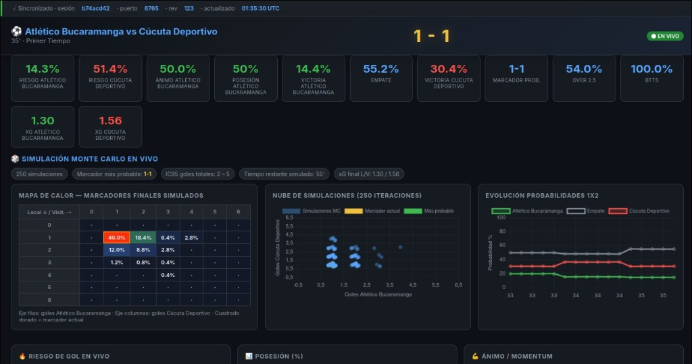

# Football Live Agent

Análisis de fútbol con extractores en vivo, dashboards de terminal y web, y predicciones probabilísticas experimentales.

## Estado de la predicción

La revisión estadística y el plan aplicado están en [docs/REVISION_Y_PLAN.md](docs/REVISION_Y_PLAN.md).

El nuevo modelo histórico acertó 51,32% de los resultados 1X2 y 12,89% de los marcadores exactos en los 380 partidos de Premier League 2024–25. Las frecuencias de liga acertaron 40,79%. Esto es una evaluación prepartido retrospectiva, no validación del modelo en vivo ni garantía de aciertos futuros. Resultados y hashes: [evaluacion_2024_25.json](docs/evaluacion_2024_25.json).

## Componentes

- modelo_poisson.py: distribución independiente de goles. Probabilidades analíticas consistentes para 1X2, totales, BTTS, próximo gol y marcadores. El muestreo sólo alimenta gráficas.
- modelo_historico.py: ataque/defensa por sede, regularización hacia la media de liga y corte temporal estricto.
- predecir_partido.py: predicción histórica reproducible sin navegador.
- evaluar_modelo.py: evaluación cronológica diaria con log loss, Brier, acierto y calibración frente a dos baselines.
- simulador.py: tasas en vivo regularizadas. Coeficientes de conversión todavía sin calibración histórica.
- calidad_vivo.py: cobertura, vigencia de la consulta y suspensión de pronósticos con datos retrasados.
- registro_vivo.py: registro SQLite de pronósticos reales y evaluación posterior con finales observados.
- motor_metricas.py: índices descriptivos de presión y momentum. Presión no es probabilidad de gol.
- predictor_previo.py: modelo histórico configurable o H2H exploratorio; abstención con menos de cinco enfrentamientos verificados.
- extractor_365scores.py: proveedor activo; otros extractores conservados como alternativas.
- main_agente.py, selector_visual.py y dashboard_web.py: selección y presentación de partidos.

El modelo histórico no implementa todavía corrección Dixon-Coles, ajuste por expulsiones ni xG por calidad de tiro. El intervalo 95% es predictivo y condicional a las tasas, no una garantía de precisión ni un intervalo de parámetros.

## Instalación

Python 3.11+ (verificado localmente con 3.12).

```powershell
python -m venv .venv
.venv/Scripts/python.exe -m pip install -r requirements-dev.txt
.venv/Scripts/python.exe -m playwright install chromium
.venv/Scripts/python.exe -m pytest -q
```

Linux/macOS: usar .venv/bin/python en lugar de .venv/Scripts/python.exe. El navegador es necesario para scraping, no para el modelo histórico ni sus pruebas.

## Evaluación y predicción histórica

Preparar CSV de una sola liga con columnas Date, HomeTeam, AwayTeam, FTHG, FTAG. Fechas admitidas: YYYY-MM-DD, DD/MM/YYYY y DD/MM/YY. El cargador rechaza duplicados y resultados inválidos.

Los CSV usados se descargaron del repositorio [datasets/football-datasets](https://github.com/datasets/football-datasets), temporadas 2324 y 2425 de premier-league, y se guardaron como data/E0-2324.csv y data/E0-2425.csv. data/ no se versiona; las rutas y hashes están en el informe.

```powershell
.venv/Scripts/python.exe evaluar_modelo.py data/E0-2324.csv data/E0-2425.csv --desde 2024-08-01
.venv/Scripts/python.exe predecir_partido.py --csv data/E0-2324.csv data/E0-2425.csv --local Arsenal --visita Chelsea --fecha 2025-05-01
```

El ejemplo es retrospectivo: nunca usa resultados del mismo día ni posteriores. Se necesitan al menos 100 partidos previos dentro de 730 días. Revisar los conteos de soporte por equipo; con poca historia domina la media de liga. Actualizar los CSV antes de pronosticar fechas actuales.

## En vivo y selector

```powershell
.venv/Scripts/python.exe web_app.py --open
```

La aplicación completa queda disponible en http://127.0.0.1:8765: selección, cambio de partido, análisis prepartido, datos en vivo y detención. El servidor escucha sólo en la máquina local. Para verificar la interfaz sin depender de proveedores externos: `.venv/Scripts/python.exe web_app.py --demo --open`.

El flujo anterior de terminal sigue disponible con `.venv/Scripts/python.exe main_agente.py`; su selector requiere una terminal compatible con curses.

Para usar el modelo histórico en la selección de partidos futuros, configurar `FOOTBALL_HISTORY` con las rutas de los CSV (separadas por `;` en Windows). La fecha llega desde el partido elegido y los nombres de los equipos deben coincidir con los CSV. Sin un histórico compatible, la web muestra un prior general claramente advertido; los partidos guardados de Flashscore pueden usar el H2H exploratorio y se abstienen si no hay cinco enfrentamientos verificables.

El horizonte en vivo predeterminado es 90 minutos. MATCH_DURATION permite un horizonte conocido de descuento. Si se alcanza el horizonte y el proveedor no confirma finalización, se suspende la predicción en lugar de presentar certeza de resultado final.

## Verificación

35 pruebas automatizadas de coherencia, entradas inválidas, cierre de partido, ceros frente a ausencias, ausencia de fuga temporal, pipeline simulado, rutas HTTP, vigencia, cambios de partido, regresiones del reloj, clientes lentos y evaluación del registro en vivo. CI configurada en `.github/workflows/tests.yml`. El scraping real depende de la disponibilidad y estructura de los proveedores y no se valida con estas pruebas.

## Observatorio en vivo

La interfaz incluye próximo gol (local, visitante o ninguno), gol en los siguientes 10 minutos —limitados por el horizonte restante—, evolución del 1X2, estadísticas comparadas, marcadores alternativos, favoritos locales, filtro de competición y exportación JSON. El modo demo tiene reloj acelerado y datos sintéticos identificados.

El modelo usa xG observado si el proveedor lo suministra; si no, utiliza remates a puerta, remates totales o el prior. No inventa xG de calidad de tiro. El histórico configurado también inicializa el análisis en vivo cuando hay al menos cinco partidos por equipo/sede. Conserva el corte temporal anterior a la fecha del encuentro. Los parámetros en vivo no están calibrados y las expulsiones se advierten sin aplicar multiplicadores arbitrarios.

Una consulta recibida hace más de 60 segundos suspende el pronóstico servido por la web; el navegador también lo retira si pierde la conexión. La edad mide la recepción local, no una garantía de actualización interna del proveedor. La cobertura cuenta estadísticas disponibles y no es una medida de acierto. Un cambio de marcador o de minuto invalida el pronóstico anterior mientras se recalcula.

Los pronósticos reales se guardan automáticamente en `data/predicciones_vivo.sqlite3`, excluido de Git. Para observar el resultado final, el análisis debe permanecer abierto hasta que el proveedor confirme la finalización; detenerlo antes deja el partido pendiente. No se recogen resultados en segundo plano después de cerrar la aplicación.

```powershell
.venv/Scripts/python.exe registro_vivo.py --minuto 60
```

Esta evaluación toma una predicción por partido en los cinco minutos previos al corte y sólo resultados finales observados después. Reporta cantidad de partidos, acierto 1X2, Brier y log loss frente a un comparador uniforme. Una muestra pequeña o seleccionada no demuestra precisión general. Las 35 pruebas comprueban software y coherencia, no el porcentaje de acierto deportivo.

Fundamentos: [xG y calidad de tiro, Hudl Statsbomb](https://statsbomb.com/soccer-metrics/expected-goals-xg-explained/) y [evaluación de probabilidades, scikit-learn](https://scikit-learn.org/stable/modules/calibration.html).

## Capturas de la versión original

Las capturas son históricas; las etiquetas y metodología han cambiado después de la revisión.



## Licencia

MIT. Ver LICENSE.
